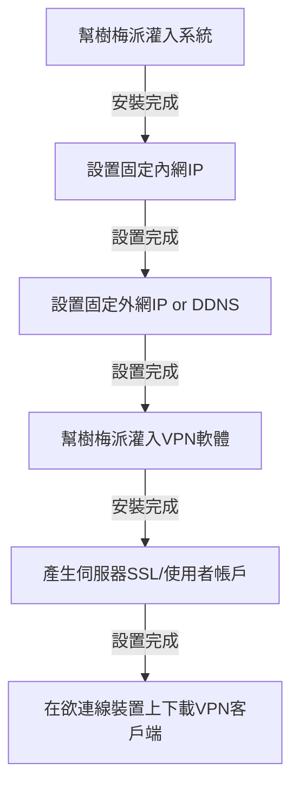

# 樹莓神秘隱者

## Concept Development
<!-- Why does your team want to build this idea/project?  -->
想去瑟瑟的網站或做壞壞的事情又不想被發現身分

## Implementation Resources
<!-- e.g., How many Raspberry Pi? How much you spent on these resources? -->
| 名稱          | 數量 |
| ------------- | ---- |
| raspberry pi3 | 1    |
| SD卡        | 1    |
| 螢幕  | 1    |
| HDMI線        | 1    |
| zyxel路由器    | 1    |

## Existing Library/Software
<!-- Which libraries do you use while you implement the project -->
系統安裝 - Pi imager

作業系統 - ubuntu

VPN設定 - PiVPN


## Implementation Process
<!-- What kind of problems you encounter, and how did you resolve the issue? -->
大致流程圖

### 實作過程
先在Pi OS lite開啟SSH功能


取得樹梅派的內網IP
```
hostname -I
```


SSH到樹梅派
```
ssh <用戶名>@<內網IP>
```

路由器設定固定IP(帳號密碼可Google路由器機型取得)


瀏覽器的gateway IP通常是192.168.1.1 or 192.168.1.0


到LAN setting裡設定static DCHP


輸入樹梅派的MAC和想要的內網IP


重啟樹梅派，刷新IP


接著我們想做


到NAT設定Port forwarding


指定一個port 轉到樹梅派的內網IP上


設定外網固定IP(固定IP已向網路供應商申請)


到WAN setting設定PPPoE的選項


接著上網查看自己外網IP是否正確即可

到NoIP申請一個域名


用Ping檢查


在樹梅派裝NoIP給的客戶端，定時更新DDNS
```
mkdir /home/<用戶名>/noip
cd /home/<用戶名>/noip
wget https://www.noip.com/client/linux/noip-duc-linux.tar.gz
```

下載好記得解壓縮，並且登入剛創的noip帳號
```
tar vzxf noip-duc-linux.tar.gz
cd /noip-2.1.9-1
sudo make
sudo make install
```
安裝PiVPN，按照以下設定


這邊選擇剛剛設定要用的port


開啟自動安全性更新


輸入 pivpn -a 增加一個新的使用者，會生成一個使用者設定檔，在/home/<用戶名>/configs


## Knowledge from Lecture
<!-- What kind of knowledge did you use on this project? -->

### VPN
**原理：**
透過VPN伺服器做為跳板，相當於用別人的電腦上網，可以事先講好通訊協定

### 固態IP & DDNS
**原理：**
相對於動態IP，是固定不變的IP;
動態(Dynamic)DNS伺服器，定時更新DNS所對應IP

### LAN and WAN
**原理：**
LAN使用內網IP，WAN使用外網IP

### Port forwarding
**原理：**
將從一個網路中的特定port接收到的數據流量轉發到另一個網路中的指定port

## Installation
<!-- How do the user install with your project? -->
PiVPN
```sh
curl -L https://install.pivpn.io | bash
```

固定IP - 跟中華電信申請


註冊NoIP


下載wireguard(或手機下載)
https://www.wireguard.com/install/


## Usage
<!-- How to use your project -->
用scp下載在樹梅派上的檔案
```
scp <用戶名>@<內網IP>:/home/<用戶名>/configs/<VPN用戶名>.conf <VPN用戶名>.conf
```


在PC端使用(下載wireguard的VPN客戶端)


載安著手機端使用(下載 Wireguard VPN客戶端 > 匯入檔案)


使用VPN前後在SSH上的差別


## 未來展望
在烏俄戰爭之後，因為俄國的網路管控原因，導致俄國人必須要用vpn才連線到外國的網站，中國也是如此，為了讓小蝦迷戰勝大鯨魚，我們希望未來能將vpn作為一個反滲透武器來使用。


## Job Assignment

|  實做  | 查資料 | github |  PPT  |  報告 | 
| ----- | ------ | ------ | ----- | ----- |
| 吉凱聖 | 吉凱聖 | 廖承偉 | 王彥仁 | 王彥仁 |
| 廖承偉 | 王新友 | 吳哲岳 | 王新友 |   -   | 
| 吳哲岳 | 廖承偉 | 王新友 | 吉凱聖 |   -   |
| 王彥仁 | 吳哲岳 |   -   |   -   |   -   | 

## References
https://github.com/pivpn/pivpn
## 簡報連結
[https://docs.google.com/presentation/d/1KQSmEWhO1FUNpS2-b8gzUJlNwKOKJmb0z7OTwvtu_cU/edit?usp=sharing](https://docs.google.com/presentation/d/1Ym1DUYAKkZOn0Syi1hsnw0TzLAo4hQCPzZPYPD0_Avs/edit?usp=sharing)https://docs.google.com/presentation/d/1Ym1DUYAKkZOn0Syi1hsnw0TzLAo4hQCPzZPYPD0_Avs/edit?usp=sharing
