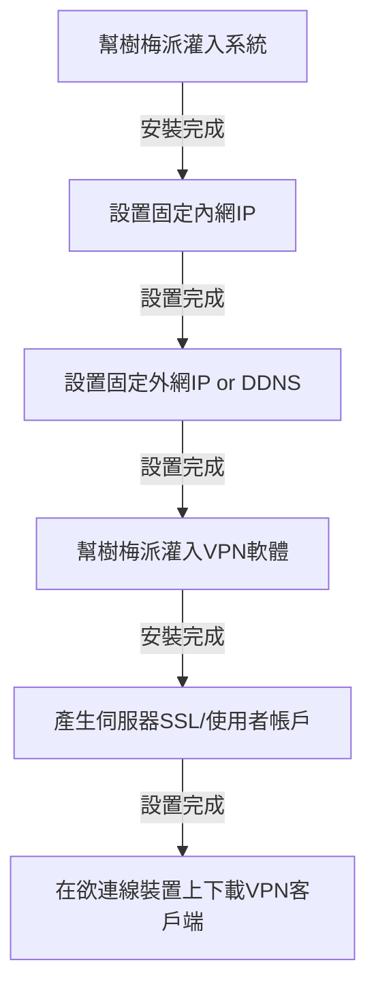

# FINAL-PROJECT-README-TEMPLATE

## Concept Development
<!-- Why does your team want to build this idea/project?  -->
想去瑟瑟的網站或做壞壞的事情又不想被發現身分

## Implementation Resources
<!-- e.g., How many Raspberry Pi? How much you spent on these resources? -->
| 名稱          | 數量 |
| ------------- | ---- |
| raspberry pi3 | 1    |
| SD卡        | 1    |
| 螢幕  | １    |
| HDMI線        | 1    |
| zyxel路由器    | 1    |

## Existing Library/Software
<!-- Which libraries do you use while you implement the project -->
系統安裝 - Pi imager

作業系統 - ubuntu

VPN設定 - PiVPN


## Implementation Process
<!-- What kind of problems you encounter, and how did you resolve the issue? -->
大致流程圖



## Knowledge from Lecture
<!-- What kind of knowledge did you use on this project? -->

### VPN
**原理：**
透過VPN伺服器做為跳板，相當於用別人的電腦上網，可以事先講好通訊協定

### 固態IP & DDNS
**原理：**
相對於動態IP，是固定不變的IP;
動態(Dynamic)DNS伺服器，定時更新DNS所對應IP

### LAN and WAN
**原理：**
LAN使用內網IP，WAN使用外網IP

## Installation
<!-- How do the user install with your project? -->
PiVPN
```sh
curl -L https://install.pivpn.io | bash
```

固定IP - 跟中華電信申請


註冊NoIP


下載wireguard(或手機下載)
https://www.wireguard.com/install/


## Usage
<!-- How to use your project -->
使用VPN前後在SSH上的差別


## Job Assignment

|  實做  | 查資料 | github |  PPT  |  報告 | 
| ----- | ------ | ------ | ----- | ----- |
| 廖承偉 | 吉凱聖 | 廖承偉 | 王彥仁 | 王彥仁 |
| 吉凱聖 | 王新友 | 吳哲岳 | 王新友 |   -   | 
| 吳哲岳 | 廖承偉 | 王新友 | 吉凱聖 |   -   |
| 王彥仁 | 吳哲岳 |   -   |   -   |   -   | 

## References
